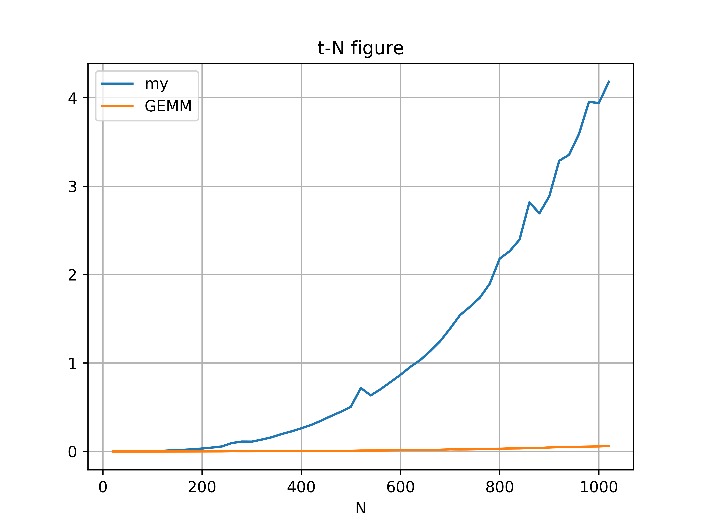
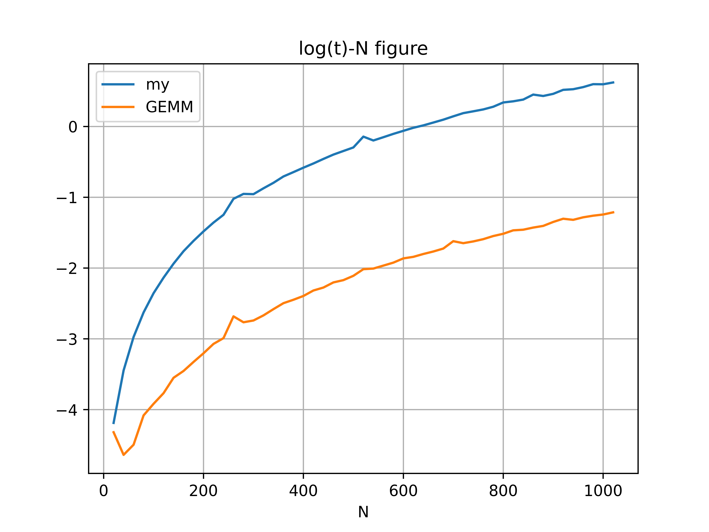

<center>苏亦凡&emsp;&emsp;计算机科学与技术学院&emsp;&emsp;200111229</center>

- [OpenBLAS库及其安装](#openblas库及其安装)
  - [BLAS](#blas)
  - [OpenBLAS](#openblas)
  - [安装OpenBLAS](#安装openblas)
    - [包管理](#包管理)
    - [在仓库下编译](#在仓库下编译)
- [gcc的使用](#gcc的使用)
  - [常用参数](#常用参数)
  - [分步编译](#分步编译)
- [gdb使用](#gdb使用)
  - [gdb命令](#gdb命令)
- [GEMM对比实验](#gemm对比实验)

# OpenBLAS库及其安装

## BLAS

> 基本线性代数子程序，Basic Linear Algebra Subprograms，是一个API标淮，用以规范发布基础线性代数操作的数值库（如矢量或矩阵乘法）。  
> Netlib用Fortran实现了BLAS的这些API接口，得到的库也叫做BLAS。

由此，BLAS指代两个有关联但性质完全不同的东西：API标准和Fortran库。

## OpenBLAS

OpenBLAS是一个BLAS(API标准)的开源实现，OpenBLAS的整体性能不够稳定，但是平均性能是所有库里面最好的。它的开发者是中国人，中科院研究所的张先义([xianyi](https://github.com/xianyi))，github仓库为[OpenBLAS](https://github.com/xianyi/OpenBLAS)

## 安装OpenBLAS

在仓库的[wiki](https://github.com/xianyi/OpenBLAS/wiki)上给出了详细的安装教程。

### 包管理

在[Precompiled-installation-packages](https://github.com/xianyi/OpenBLAS/wiki/Precompiled-installation-packages#linux)中作者给出了安装已编译版本的方法。
```bash
sudo apt install libopenblas-dev
```
编译测试文件。
```bash
gcc test.c -o test -lopenblas
./test
```

### 在仓库下编译

clone仓库，使用gitee上的镜像。
```bash
git clone https://gitee.com/mirrors/OpenBLAS.git
```
接着进仓库进行编译
```bash
cd OpenBLAS
make
```
编译结束会提示，此时用
```bash
make PREFIX=/root/codefield/hpc/lesson2 install
```
将依赖项装进lesson2文件夹。

编译测试文件。
```bash
# -I 头文件文件夹  -L lib文件夹
gcc test.c  -I ./include/ -L ./lib -lopenblas -o test
./test
```
输出
```
0.000000 1.000000 2.000000 3.000000 4.000000 5.000000 6.000000 7.000000 8.000000 9.000000 
90.000000 81.000000 72.000000 63.000000 54.000000 45.000000 36.000000 27.000000 18.000000 9.000000
```

# gcc的使用

## 常用参数

|参数|含义|
|---|---|
|`-E`|生成预处理文件(.i)|
|`-S`|生成汇编代码(.s)|
|`-c`|生成机器码(.o)|
|`-o`|指定输出|
|`-I`|指定头文件目录|
|`-L`|指定库文件目录|
|`-l`|链接库|
|`-finput-charset`|指定源文件字符集|
|`-fexec-charset`|指定 const char* 字符集|

## 分步编译

```bash
gcc -E hello.c -o hello.i
gcc -S hello.i -o hello.s
gcc -c hello.s -o hello.o
gcc hello.o -o hello
```

# gdb使用

```bash
gcc -g hello.c -o hello
```
## gdb命令
|命令|简写|含义|
|:-:|:--:|---|
|help|h|+命令查看帮助|
|run|r|从头开始运行程序|
|start|—|从头开始单步运行程序|
|list|l|查看源代码|
|break|—|+num在num行设置断点|
|info breakpoints|—|查看当前设置的所有断点|
|delete breakpoints|—|+num删除第num个断点|
|next|n|单步执行(遇到函数同)|
|step|s|单步执行(函数直接执行)|
|continue|c|执行至下一断点|
|finish|—|结束当前函数|
|info|i|查看局部变量的数值|
|print|p|打印变量|
|display|—|追踪变量|
|watch|—|设置观察点|
|quit|q|退出gdb|

# GEMM对比实验

分别用GEMM与数学定义式完成矩阵乘法的计算，并使用clock函数计时。为直观看出优化程度，我们在[20,1024]中均匀取数作为矩阵的规模，分别计时并按照csv文件格式输出。

源代码位于文件夹 [src](./src) 中，使用脚本 [gcc.sh](.src/gcc.sh) 一键分布编译并运行。其中两矩阵的数据为 [makematrix.py](./matrix/makematrix.py) 随机生成。保存的csv文件经由 [process.py](./matrix/process.py) 处理为图片。

实验结果如下。

  
横坐标为矩阵规模$N$，纵坐标为时间$t$，单位秒。

由于两条曲线变化量差别很大，故对纵坐标取对数。得到下图：  
  

可见规模在[20,1024]时，两算法的用时差距大概在1个数量级左右。

曲线中部不平滑的地方应为数据导致，取多组随机数并取每组平均数应能降低该偶然误差。

有趣的是，GEMM的曲线在一开始出现了下降的情况，可能是算法本身导致的。

