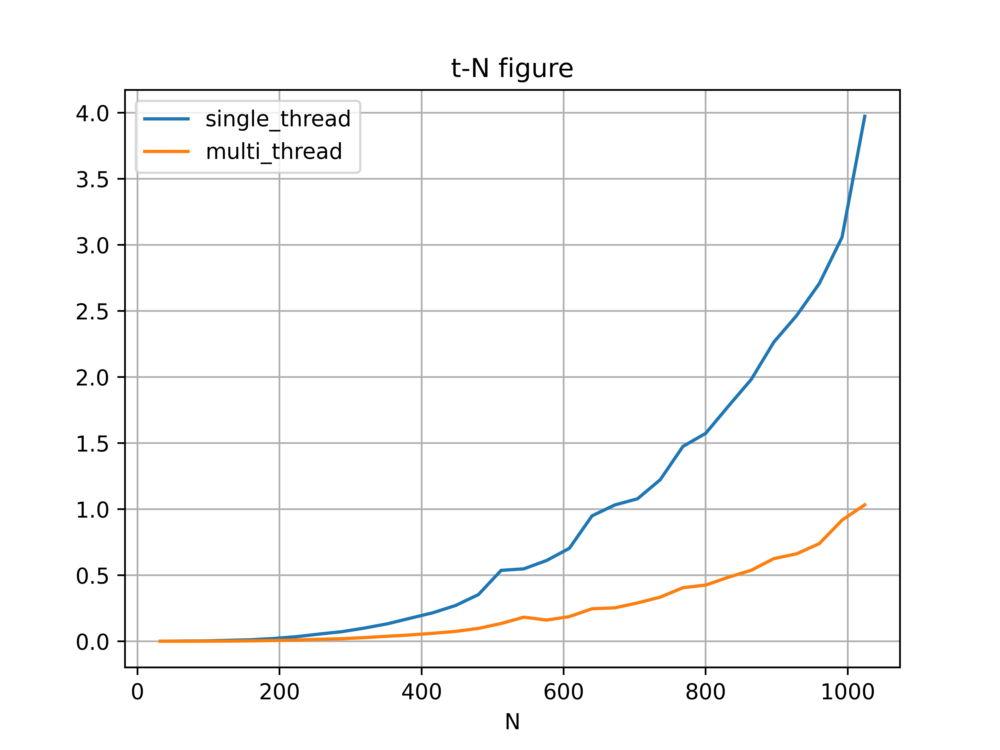
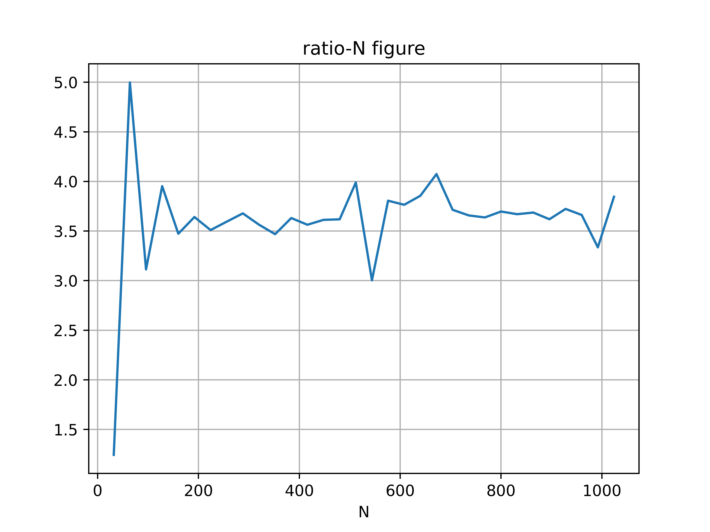

<center>苏亦凡&emsp;&emsp;计算机科学与技术学院&emsp;&emsp;200111229</center>

- [线程](#线程)
- [线程控制函数](#线程控制函数)
- [多线程server](#多线程server)
- [多线程矩阵乘法](#多线程矩阵乘法)

# 线程

线程（英语：thread）是操作系统能够进行运算调度的最小单位。大部分情况下，它被包含在进程之中，是进程中的实际运作单位。一条线程指的是进程中一个单一顺序的控制流，一个进程中可以并发多个线程，每条线程并行执行不同的任务。在Unix System V及SunOS中也被称为轻量进程（lightweight processes），但轻量进程更多指内核线程（kernel thread），而把用户线程（user thread）称为线程。

同一进程中的多条线程将共享该进程中的全部系统资源，如虚拟地址空间，文件描述符和信号处理等等。但同一进程中的多个线程有各自的调用栈（call stack），自己的寄存器环境（register context），自己的线程本地存储（thread-local storage）。[^1]

# 线程控制函数

|函数原型|作用|
|---|---|
|`int pthread_create(pthread_t *tidp, const pthread_attr_t *attr,( void *)(*start_rtn)( void *), void *arg);`|创建线程|
|`int pthread_join(pthread_t thread, void **retval);`|等待线程结束|

# 多线程server

在原始的server程序中，由于检测到客户端连接后，系统在响应时需要进行复杂的处理(用sleep模拟)，所以从客户端发起连接到客户端收到连接耗费了相当多的时间。于是如果其他客户端在服务器处理请求时发起连接，需要等待程序处理完上一请求后才能收到响应。

解决该问题的关键是利用`pthread_create`产生的线程处理请求，主线程始终保持对客户端的监听，从而同时处理多个请求。

# 多线程矩阵乘法

使用的CPU为i7-1065G7，规格为四核心。实验中使用四线程进行运算。

对于两方阵的乘法运算$A\times B$，可将$A$按列分为四个部分，分别计算结果。

多线程矩阵运算核心代码如下：

```c{.line-numbers}
void calc(arg *x)
{
    int N = x->N;
    for (int i = x->l; i < x->r; ++i)
        for (int j = 0; j < N; ++j)
            for (int k = 0; k < N; ++k)
                c(i, j) += a(i, k) * b(k, j);
}

void multi_thread_matmul(int N)
{
    pthread_t t[4];
    int len = N / 4;
    for (int i = 0; i < 4; ++i)
    {
        x[i].N = N;
        x[i].l = i * len;
        x[i].r = (i + 1) * len;
        if (pthread_create(&t[i], NULL, (void *)calc, &x[i]) != 0)
        {
            printf("failed to create a thread.\n");
            exit(0);
        }
    }

    for (int i = 0; i < 4; ++i)
        pthread_join(t[i], NULL);
}
```

在[0,1024]以步长为32取矩阵规模，比较单线程串行运算与多线程并行运算的时间。得到下图。
  
可以发现串行运算时间总是比并行要长。

去串行运算时间与并行运算的比值，得到下图。
  
可以得到随着矩阵规模的增大，比值稳定在3到4之间。联系到实验中调用的线程数为4，可知将运算分为4线程最大可将算法用时缩减为原来的1/4，但由于进程的调度以及分解问题的操作需要耗费一定的时间，往往在实际运用中无法达到4倍提升。


[^1]:https://zh.wikipedia.org/wiki/线程