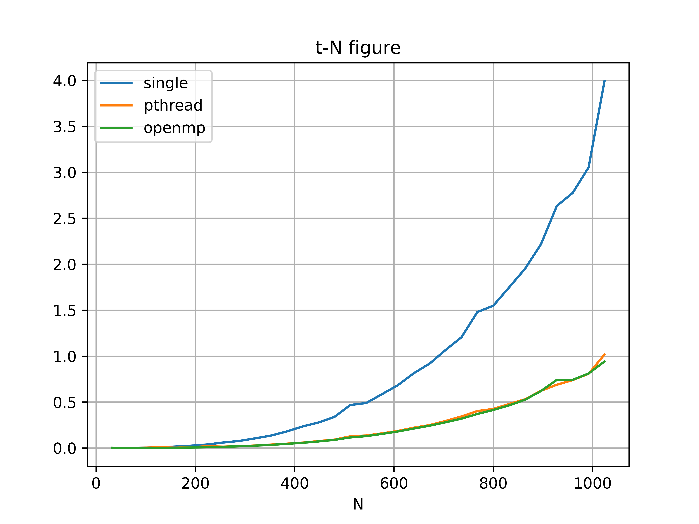
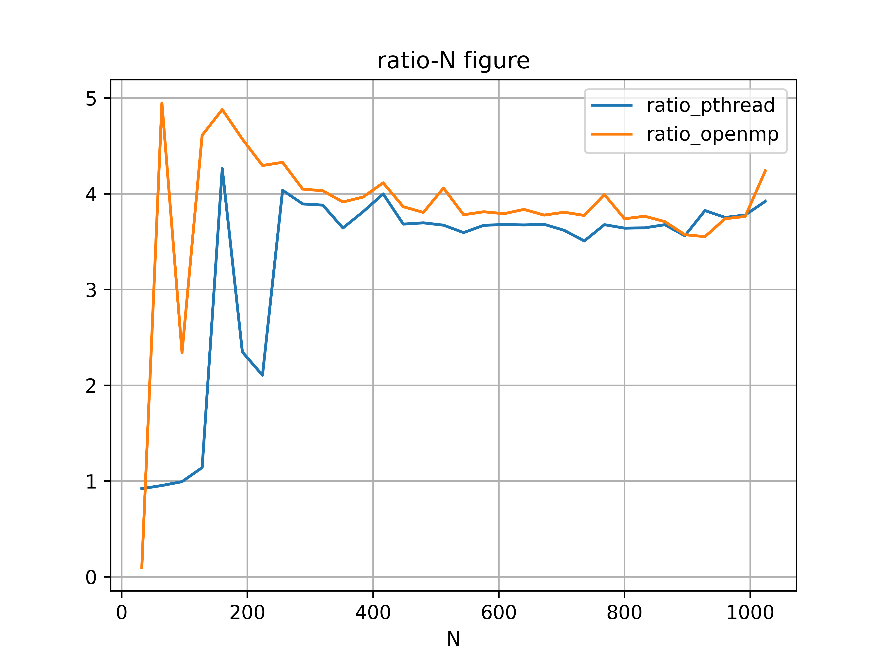

<center>苏亦凡&emsp;&emsp;计算机科学与技术学院&emsp;&emsp;200111229</center>

# 实验五

## 实验内容

使用OpenMP实现多线程计算矩阵乘法，并与单线程计算，pthread实现的多线程计算进行比较。

## 设计方案

本次实验所用的CPU为i7-1065G7，规格为四核心。使用pthread实现多线程计算与实验四一致。使用OpenMP实现只需在单线程的基础上在`for`循环前加上预处理指令，即：
```c
#pragma omp parallel for
```

核心代码如下
```c{.line-numbers}
void omp_matmul(int N)
{
    #pragma omp parallel for shared(A, B, C)
    for (int i = 0; i < N; ++i)
        for (int j = 0; j < N; ++j)
            for (int k = 0; k < N; ++k)
                c(i, j) += a(i, k) * b(k, j);
}
```

在[0,1024]以步长为32取矩阵规模，比较单线程串行计算与两种多线程计算的时间，并按照格式写入[data.csv](./src/matrix/data.csv)。最后利用python进行数据的处理。

## 实验数据

原始数据[^1]

三种计算方法的时间比较：


两种多线程实现方法的加速比率：


## OpenMP和pthread的区别

不需要手动实现线程的创建与同步，操作简便，代码可读性更好，但要求代码可并行且符合要求。两种方法对时间效率的提升区别不大。

[^1]:<table>
    <tr>
        <td>N</td>
        <td>single</td>
        <td>pthread</td>
        <td>openmp</td>
    </tr>
    <tr>
        <td>32</td>
        <td>0.000313</td>
        <td>0.000340</td>
        <td>0.003299</td>
    </tr>
    <tr>
        <td>64</td>
        <td>0.001168</td>
        <td>0.001225</td>
        <td>0.000236</td>
    </tr>
    <tr>
        <td>96</td>
        <td>0.003631</td>
        <td>0.003654</td>
        <td>0.001551</td>
    </tr>
    <tr>
        <td>128</td>
        <td>0.009098</td>
        <td>0.007976</td>
        <td>0.001973</td>
    </tr>
    <tr>
        <td>160</td>
        <td>0.015977</td>
        <td>0.003747</td>
        <td>0.003274</td>
    </tr>
    <tr>
        <td>192</td>
        <td>0.025806</td>
        <td>0.010990</td>
        <td>0.005645</td>
    </tr>
    <tr>
        <td>224</td>
        <td>0.038670</td>
        <td>0.018369</td>
        <td>0.009002</td>
    </tr>
    <tr>
        <td>256</td>
        <td>0.060160</td>
        <td>0.014902</td>
        <td>0.013898</td>
    </tr>
    <tr>
        <td>288</td>
        <td>0.076850</td>
        <td>0.019734</td>
        <td>0.018979</td>
    </tr>
    <tr>
        <td>320</td>
        <td>0.105005</td>
        <td>0.027051</td>
        <td>0.026046</td>
    </tr>
    <tr>
        <td>352</td>
        <td>0.135394</td>
        <td>0.037168</td>
        <td>0.034585</td>
    </tr>
    <tr>
        <td>384</td>
        <td>0.180309</td>
        <td>0.047295</td>
        <td>0.045461</td>
    </tr>
    <tr>
        <td>416</td>
        <td>0.235072</td>
        <td>0.058783</td>
        <td>0.057133</td>
    </tr>
    <tr>
        <td>448</td>
        <td>0.278006</td>
        <td>0.075475</td>
        <td>0.071925</td>
    </tr>
    <tr>
        <td>480</td>
        <td>0.338344</td>
        <td>0.091524</td>
        <td>0.088912</td>
    </tr>
    <tr>
        <td>512</td>
        <td>0.468064</td>
        <td>0.127456</td>
        <td>0.115266</td>
    </tr>
    <tr>
        <td>544</td>
        <td>0.489942</td>
        <td>0.136288</td>
        <td>0.129574</td>
    </tr>
    <tr>
        <td>576</td>
        <td>0.586360</td>
        <td>0.159738</td>
        <td>0.153804</td>
    </tr>
    <tr>
        <td>608</td>
        <td>0.684697</td>
        <td>0.186091</td>
        <td>0.180568</td>
    </tr>
    <tr>
        <td>640</td>
        <td>0.814230</td>
        <td>0.221574</td>
        <td>0.212196</td>
    </tr>
    <tr>
        <td>672</td>
        <td>0.919583</td>
        <td>0.249789</td>
        <td>0.243431</td>
    </tr>
    <tr>
        <td>704</td>
        <td>1.066980</td>
        <td>0.294868</td>
        <td>0.280252</td>
    </tr>
    <tr>
        <td>736</td>
        <td>1.205828</td>
        <td>0.343792</td>
        <td>0.319504</td>
    </tr>
    <tr>
        <td>768</td>
        <td>1.480039</td>
        <td>0.402458</td>
        <td>0.370725</td>
    </tr>
    <tr>
        <td>800</td>
        <td>1.548641</td>
        <td>0.425311</td>
        <td>0.414149</td>
    </tr>
    <tr>
        <td>832</td>
        <td>1.748357</td>
        <td>0.479740</td>
        <td>0.464277</td>
    </tr>
    <tr>
        <td>864</td>
        <td>1.950671</td>
        <td>0.530488</td>
        <td>0.525825</td>
    </tr>
    <tr>
        <td>896</td>
        <td>2.216566</td>
        <td>0.622340</td>
        <td>0.620382</td>
    </tr>
    <tr>
        <td>928</td>
        <td>2.634195</td>
        <td>0.688646</td>
        <td>0.741486</td>
    </tr>
    <tr>
        <td>960</td>
        <td>2.775800</td>
        <td>0.739612</td>
        <td>0.742244</td>
    </tr>
    <tr>
        <td>992</td>
        <td>3.052660</td>
        <td>0.807923</td>
        <td>0.811112</td>
    </tr>
    <tr>
        <td>1024</td>
        <td>3.990788</td>
        <td>1.017640</td>
        <td>0.941204</td>
    </tr>
</table>
