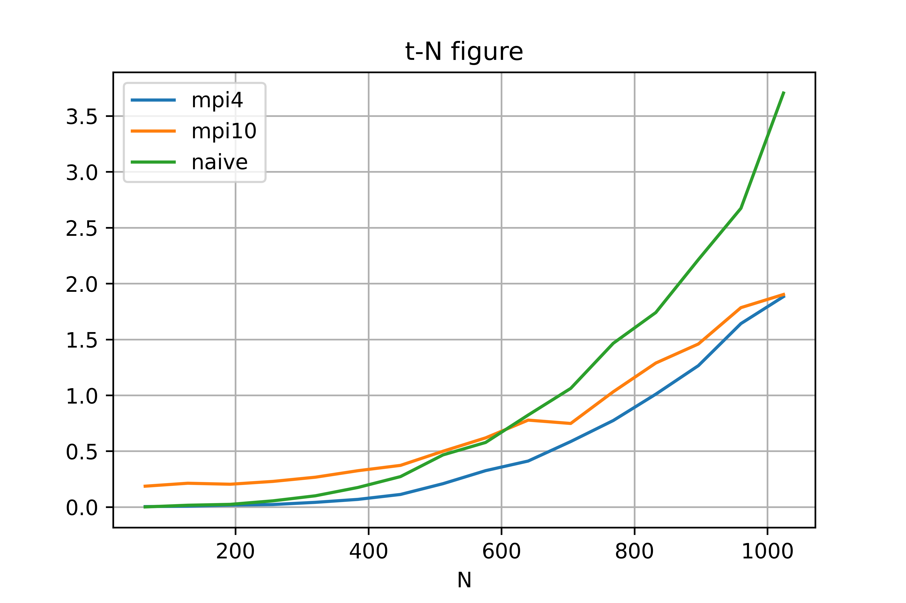
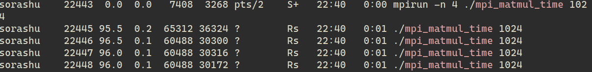

<center>苏亦凡&emsp;&emsp;计算机科学与技术学院&emsp;&emsp;200111229</center>

# 实验内容

通过MPI点对点通信实现矩阵乘法的多进程计算。

# 设计方案

使用分行计算，各个进程单独计算后，通过点对点通信向主进程发送信息，主进程接受消息并填入矩阵。

在自动化处理时我们希望程序从命令行接受矩阵规模这一参数。于是我们在运行时让程序接受参数，通过`atoi`转换成矩阵规模，利用shell脚本进行自动化处理并得到实验数据。

# 代码

```c
#include <stdio.h>
#include <stdlib.h>
#include <mpi.h>
#include <sys/time.h>
#include <string.h>

void readMatrix(double **m, FILE *f, int siz)
{
    for (int i = 0; i < siz; ++i)
    {
        for (int j = 0; j < siz; ++j)
        {
            fscanf(f, "%lf", &m[i][j]);
        }
    }
}

double **createMatrix(int siz)
{
    double **a = (double **)malloc(sizeof(double *) * 1024);
    for (int i = 0; i < siz; ++i)
    {
        a[i] = (double *)malloc(sizeof(double *) * 1024);
        memset(a[i], 0, sizeof(double));
    }
    return a;
}

int main(int argc, char *argv[])
{
    int n = atoi(argv[1]);
    double **a = createMatrix(n);
    double **b = createMatrix(n);
    double **c = createMatrix(n);
    FILE *fmatrixA = fopen("./matrix/matrixA.txt", "r");
    FILE *fmatrixB = fopen("./matrix/matrixB.txt", "r");
    readMatrix(a, fmatrixA, n);
    readMatrix(b, fmatrixB, n);
    int numprocs, myid, source;
    MPI_Status status;

    struct timeval start, end;
    gettimeofday(&start, 0);
    MPI_Init(&argc, &argv);
    MPI_Comm_rank(MPI_COMM_WORLD, &myid);
    MPI_Comm_size(MPI_COMM_WORLD, &numprocs);
    if (myid != 0)
    {
        double *ans = malloc(sizeof(double) * n);
        for (int p = myid - 1; p < n; p += (numprocs - 1))
        {
            for (int j = 0; j < n; ++j)
            {
                ans[j] = 0;
                for (int k = 0; k < n; ++k)
                {
                    ans[j] += a[p][k] * b[k][j];
                }
            }
            MPI_Send(ans, n, MPI_DOUBLE, 0, p, MPI_COMM_WORLD);
        }
    }
    else
    {
        for (source = 1; source < numprocs; source++)
        {
            for (int p = source - 1; p < n; p += (numprocs - 1))
            {
                MPI_Recv(c[p], n, MPI_DOUBLE, source, p, MPI_COMM_WORLD, &status);
            }
        }
        gettimeofday(&end, 0);
        long seconds = end.tv_sec - start.tv_sec;
        long microseconds = end.tv_usec - start.tv_usec;
        double elapsed = seconds + microseconds * 1e-6;
        printf("%d,%lf\n", n, elapsed);
    }
    MPI_Finalize();
    return 0;
}
```

## 实验数据

其中mpi4表示4进程，mpi10表示10进程。



理论上 $1024\times 1024$ 的矩阵储存开销为 64Mb，实际上的储存开销为如图：



## 分析

在矩阵规模较小的时候，mpi多进程的矩阵计算用时都大于原本的串行计算，但当矩阵规模增大，多进程在用时上逐渐体现出优势来。

10进程的程序用时在测试的矩阵规模范围内用时均大于4进程的程序。但在最终的曲线趋势中，我们可以预测10进程的程序在矩阵规模继续增大时将超过4进程的程序。

这可能是由于mpi通信的数据传输需要消耗一定时间，进程数越多，通信的时间开销就越大。

对于内存开销，实际运行时的内存开销大于理论开销，这是由于堆、栈空间、以及MPI通信的初始化以及运行等需要一定的内存。

MPI框架难以用于HTTP服务器的改造。MPI程序在开始时就将创建好所有进程，无法动态地开启与关闭进程。